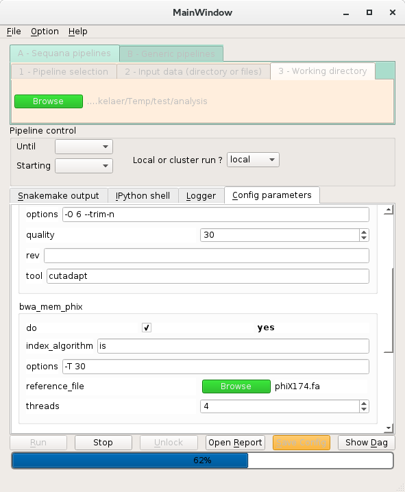

.. _applications:

Applications (standalone)
============================

.. contents::

.. _sequanix:

Sequanix: GUI for snakemake workflows
-------------------------------------------

:Overview: a Graphical User Interface (GUI) for Sequana pipelines and any
    Snakemake-based workflows.
:Status: Production
:Name: sequanix

This GUI can be used to load Snakefile and their configuration file. A 
working directory has to be set. Once done, the configuration file can be 
changed in the GUI. Finally, one can run the snakefile and see the progress.
Tooltips are automatically created from the configuration file (if documented).

Since snakemake has the ability to run jobs locally or on a cluster, this 
application can also be run either locally or a distributed computing platform
(e.g., cluster with slurm scheduler). Of course, this means you can use a X
environment on your cluster (ssh -X should do it).

Just type **sequanix** in a shell.

.. note:: tested under Linux only. However, Mac and Windows users should be
   able to use it since it is based on Python and PyQt. Again, we strongly
   advice to use Anaconda to install all required dependencies

Here is a snapshot.

.. _sequana_app:

sequana
---------

:Deprecated: will be removed and replaced by Sequanix
:Overview: Creates project(s) to run a **Sequana** pipeline(s)

The **sequana** executable can be used to create pipelines (and associated
config file). For example::

    sequana --pipeline quality --file1 R1.fastq.gz --file2 R2.fastq.gz --project TEST

will create a directory called TEST with a few files such as *quality.rules*,
*config.yaml*, a *runme.sh* and a *README* file.

Valid pipelines can be found using::

    sequana --show-pipelines

There are many more options and documentation. Please use the ``--help``
option for more information.

.. _standalone_sequana_coverage:

sequana_coverage
--------------------

:Description: Show coverage and interval of confidence to identify under and
    over represented genomic regions.
:Help: please use sequana_coverage ``--help``
:Docker: ::
    
        git pull sequana/sequana_coverage 

    See `github sequana_coverage docker page <https://github.com/sequana/sequana/tree/master/docker/sequana_coverage>`_ for details
:Sequana: See :class:`~sequana.bedtools.GenomeCov` to use the coverage in your own script.
:Gallery: See examples in the `gallery <http://sequana.readthedocs.io/en/master/auto_examples/index.html>`_

Starting from a BED file and its reference, one can use this command in a
shell::

    sequana_coverage  --input JB409847.sorted.bed -o
                      --reference JB409847.fa --show-html

It creates an HTML report with various images showing the coverage and GC
versus coverage plots. It also provides a set of CSV files with low or high
coverage regions (as compared to the average coverage).

.. seealso:: the underlying algorithm is described in details in the documentation
    (:mod:`sequana.bedtools.GenomeCov`).

sequana_summary
------------------

:Description: Prints basic statistics about a set of NGS input files. Currently
    handles Fastq (gzipped or not) or BED files (coverage).

sequana_mapping
------------------
:Description: a simple application to map reads onto a genome given one or two
    FastQ files (gzipped) and a refenrece.

sequana_taxonomy
--------------------

:Description: Creates a HTML document with Krona and pie chart of taxonomic
    content of a st of FastQ files. Uses Kraken and a dedicated Sequana
    database.

fastq related: fastq_count
-----------------------------

:Description: count number of reads and lines

Example::

    fastq_count --input test.fastq.gz

fastq related: fastq_head 
-----------------------------

:Description: Extract head of a fastq files (zipped or not)

Example::

    fastq_head --input input.fastq.gz --nlines 10000 --ouput output.fastq.gz

sequana_compressor
---------------------

:Description: standalone on top of the compressor pipeline to
    compress/decompress FastQ files in different formats, recursively 
    and using multithreaded and multicore tools. 

Please see :ref:`pipeline_compressor` for details.
