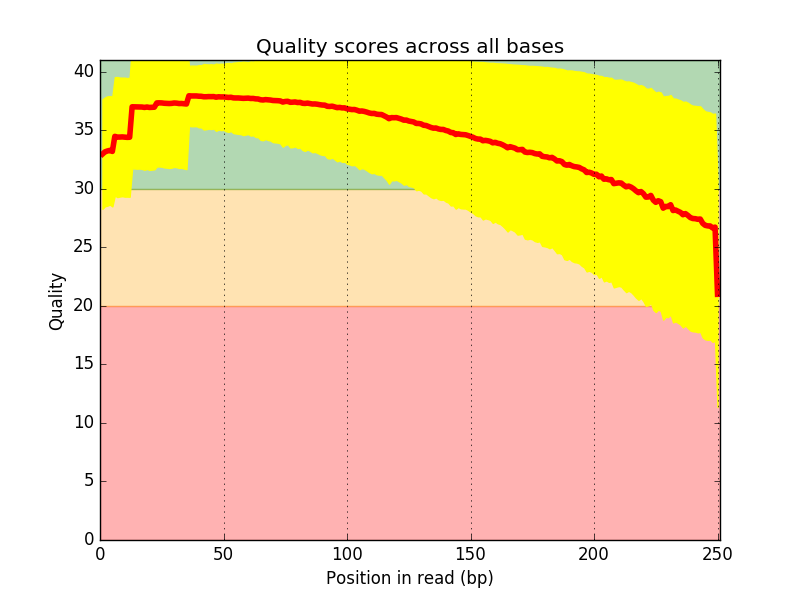
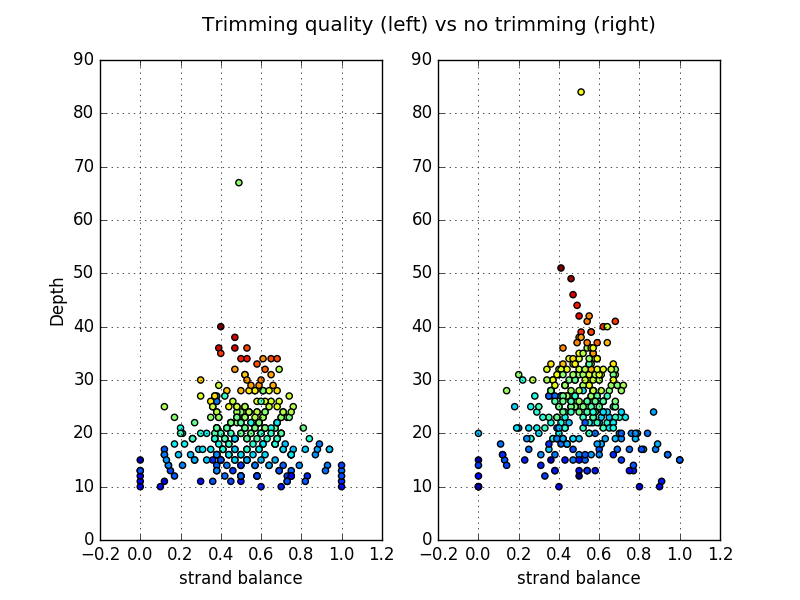

Effect of the trimming of SNPs detection
===========================================

:Description: 

In this case example, we will take a paired-end data set, and apply the quality
pipeline using trimming quality (removing bases with quality below 30). Then, we
will run the variant calling pipeline to (1) perform the mapping on a reference
and detect SNPs. 

We will repeat this analysis without trimming low quality reads at all. 

We will finally compare the two sets of SNPs showing that the trimming quality
is not important in this example. Meaning that the mapping tool used (freebayes)
is able to cope with low quality reads.

The data
------------

We will use a paired-end data set (MiSeq 250bp). It contains 250,000 reads
(X2). The organism sequenced is *Bordetella*. As a reference, we use
the ENA accession *CP010347.1*. 

Here is a boxplot of the base quality across the reads showing that the quality
is quite high and falls below 30 after 200 bases.

Quality pipeline
------------------

Assuming DATA (fastq.gz files) are in <DIR1> directory, type to create the
**quality** pipeline and config file automatically::

    sequana --pipeline quality --input-dir <DIR1> 

Edit the *config.yaml* file and set the project to *trim*. Run the analysis::

    snakemake -s variant_calling.rules --stats stats.txt -p -j 4

The final clean reads are in trim/cutadapt/ (trim_R1.cutadapt.fastq.gz)

Let us refer to this directory as <DIR2>.

These files will be the input to the variant pipeline as explained hereafter.

.. seealso:: :ref:`tutorial` section for details

Variant analysis
------------------

::

    sequana --pipeline variant_calling --input-dir <DIR2>

Here you need to make sure you have the correct reference and need to fill the
config file as explained in :ref:`tutorial` section (variant section).

In the config file, set the name of the projct to **variant**.

Run the analysis. Once done, you should have VCF files in
variant/report/cutadapt.ann.vcf

No trimming
-------------

repeat the previous two steps. The only difference is in the quality step to
change the cutadapt section to prevent the trimming of bad quality bases::

    cutadapt:
        quality: 0,0

Change the project name to have *notrim* as a tag to the project names.

SNPs results comparison 
----------------------------

You should now have two VCF files. Here below we plot the read depth versus
strand balance. The color will indicates the overall freebayes score (normalised
by the largest score). A *good* candidate should have large score and balance
value around 0.5 The y-axis shows the read depth.

:: 

    from pylab import *

    from sequana import vcf_filter

    vcf1 = vcf_filter.VCF("variant/report/cutadapt.ann.vcf")
    vcf2 = vcf_filter.VCF("variant_no_trimming/report/variant_no_trimming.ann.vcf")
        df1 = vcf1.vcf_to_csv("dummy")
    df2 = vcf2.vcf_to_csv("dummy")

    subplot(1,2,1)
    scatter(list(df1.strand_balance.values), list(df1.depth.values),
    c=list(df1.freebayes_score.values/1240))
    xlabel("strand balance")
    ylabel("Depth")
    grid()
    ylim([0,90])

    subplot(1,2,2)
    scatter(list(df2.strand_balance.values), list(df2.depth.values),
        c=list(df2.freebayes_score.values/1240))
    grid()
    ylim([0,90])
    title("Trimming quality (left) vs no trimming (right)
    \n")

In this figure the LHS (trimming) 294 SNPs were found while in the RHS (no
trimming)  309  were found. The additional SNPs all have low coverage below 20.
A third of them have low balance strand.

There is one SNP found in the trim case not found in no_trim. Howeve, it is
marginal with strand balance of 0.12, depth of 11, fruquence of 0.73 and one of the lowest score  

Conclusions
--------------

The detection of SNPs does not suffer from not trimming low quality bases below
30. Actually, some new SNPs are found. However, the are usually not significant
(low depth, low score or unbalanced). Interestingly, the distribution of the
SNPs in the depth vs strand balance plane seems to be more centered on strand
balance=0.5 could be interesting to extend the analysis to more data, lower
quality, or higher quality threshold.

