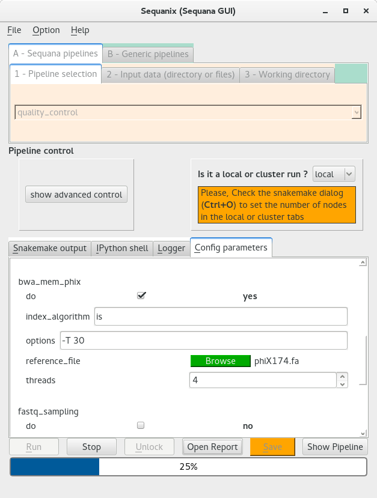
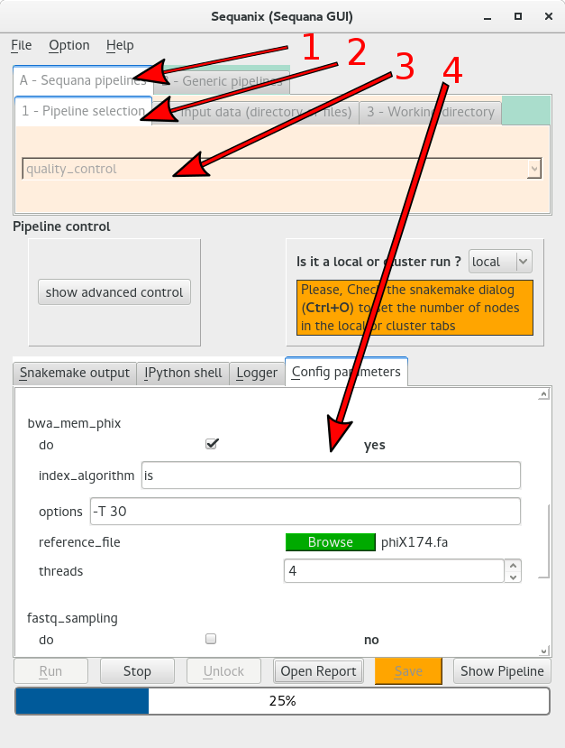
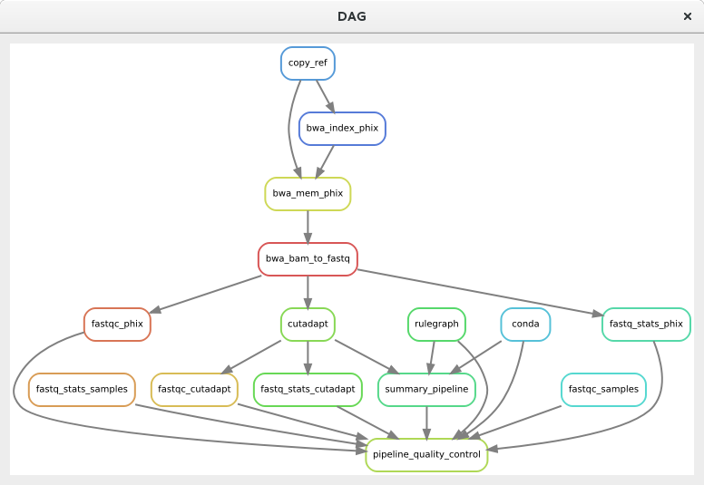
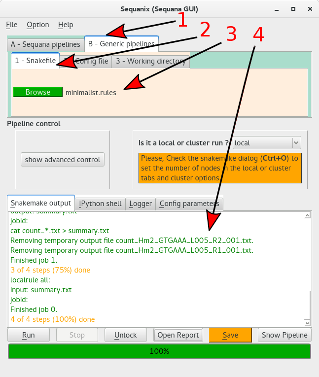
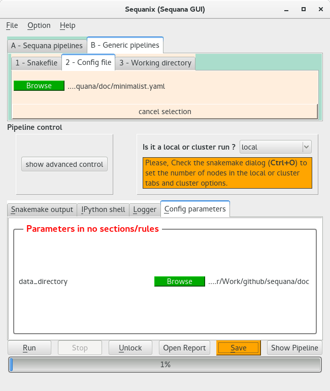
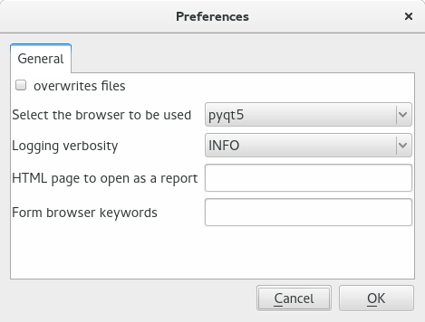
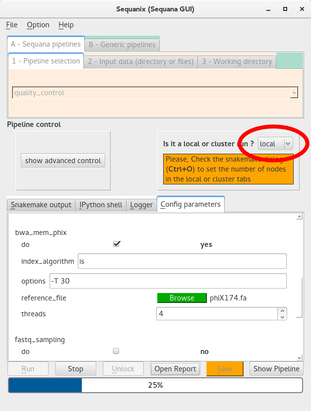
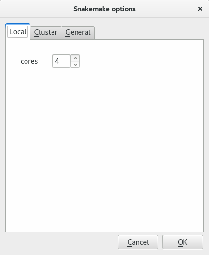
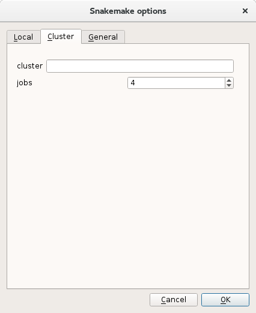
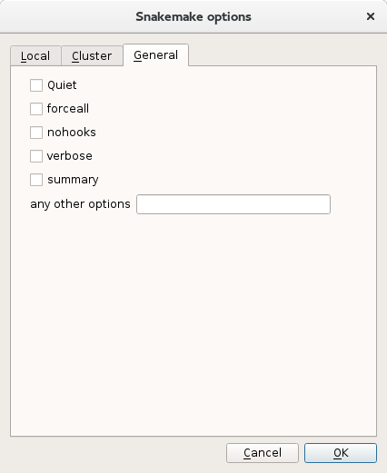

.. _sequanix_tutorial:

Sequanix Tutorial
====================

.. contents::
   :local:

Introduction
---------------
**Sequanix** is a graphical user interface (GUI) that can be used to run Snakemake workflows.
The standalone name is **sequanix** (small caps) and is part of **Sequana**
library.

The primary goal was to provide a GUI to easily run **Sequana pipelines** (designed
as Snakemake workflows).

However, we extended the interface so that it can handle other Snakemake
workflows, referred to as **Generic pipelines** in the GUI.

    Snapshot of the Sequanix graphical user interface (GUI)

In this section, we first show how to run one of our Sequana pipeline (quality
control pipeline). Second, we show how to run **Generic pipelines** that are not
part of Sequana. For these two examples, the computation is done locally.
However, one strength of Snakemake pipelines is that they can be executed on
various cluster without changing the pipeline itself. The
third section shows how to run the analysis on a cluster (SLURM and SGE frameworks).

Snakemake pipelines are made of 2 parts: a pipeline and an optional
configuration file; The pipeline may be called **Snakefile**. It contains the code
of the pipeline itself. Keep in mind that
in the Snakefile, developer may link the pipeline to an external configuration
file: the **config** file, which is encoded in :term:`YAML` or :term:`JSON` format.

Sequana pipeline: the quality control example
----------------------------------------------------

Prerequisites: get some data
~~~~~~~~~~~~~~~~~~~~~~~~~~~~~~~~~~

The following example will show how to run a quality control pipeline on a pair of FastQ files. The data comes from a sequencing platform (using HiSeq technology) of a Measles virus. For testing purposes, you can download :download:`R1 <../sequana/resources/data/Hm2_GTGAAA_L005_R1_001.fastq.gz>` and :download:`R2 <../sequana/resources/data/Hm2_GTGAAA_L005_R2_001.fastq.gz>`)
files that contain only 1500 reads. Copy the two files in a local directory (let us call
it **testing**) and start **sequanix**.

::

    cd testing
    sequanix

Select the quality control pipeline
~~~~~~~~~~~~~~~~~~~~~~~~~~~~~~~~~~~~~~~~~~~
First you need to select the pipeline of interest (here the *quality_control*).
In the following figure, you need to

#. select the *sequana pipelines* tab (arrow 1),
#. select the *pipeline section* tab (arrow 2)
#. select the pipeline in the dropdown box (arrow 3)

Once done, the configuration file of the pipeline will be loaded in the **Config
parameters** tab (arrow 4).

Select the input data (directory or files)
~~~~~~~~~~~~~~~~~~~~~~~~~~~~~~~~~~~~~~~~~~~~~~~~~

Once the pipeline is selected, you need to give information about the location
of the input data. Generally, the pipelines take fastq.gz files as input. 

In general we have many samples, so you need to select the **Input directory**
tab. If you have only one or two files, you may use the other tab 
(**Input sample(s)**).

Here, we consider the first case only (directory). First click on the 
red Browse button (figure below)
to select the directory where is the data. By default, we assume that there is a
special tag in the filenames (_R1_ or _R2_)
but one can change it to another pattern. Note also that we expect by default
the input files to end up in fastq.gz

So by default if you select a directory, all files ending in *fastq.gz* will be
selected.

.. figure:: _static/sequanix/sequanix_input_data.png
    :width: 80%

    In the input data section, you have to click on the red browser button to
    select the directory where to find the FastQ (gzipped) files.

.. note:: The directory browser can create directories 

    .. figure:: _static/sequanix/sequanix_browser.png
        :width: 80%

        In the browser, you can either select an existing directory, or create a new
        one by clickin on the **Create Folder** (red ellipse on top left corner). 
        Note that depending on your system, the layout may be different

Select the working directory
~~~~~~~~~~~~~~~~~~~~~~~~~~~~~~~~~

As above, when clicking on the browser button, you may select an existing one or
create a new one.

Fine tune the config parameters
~~~~~~~~~~~~~~~~~~~~~~~~~~~~~~~~~~~~~

.. warning:: Sequana pipelines may be complex with several dependencies on
    external tools. We would recommend users to look at the online
    documentation for help (e.g., :ref:`tutorial`, :ref:`pipelines`).

One major interest of **Sequanix** is that the Snakemake configuration file is
loaded and can then be changed dynamically. In other word, you do not need to
use an esoteric text editor, which may be the only option on a cluster.

Moreover, the loaded configuration file has other advantages:

- file can be selecting thanks to a file browser. If no file is selected, the button is red (green otherwise)
- Some buttons have dedicated widgets (e.g. in the figure above, the number of threads has its own dropbox limited typing errors)
- Boolean have their own checked button
- etc

.. note:: For developers: please see the :ref:`config_coding_convention` section to see
   how to write your configuration to have the widgets loaded automatically.

Save, check and run the project
~~~~~~~~~~~~~~~~~~~~~~~~~~~~~~~~~~~~~~~

Once the parameters have been set, it is time to save the project. You can
either click the yellow box **Save** in the bottom bar or the **Ctrl+S** shortcut.

The configuration and pipelines files are then save in the working directory
defined above. If the files already exists, a dialog box ask you to confirm that
you want to overwrite the existing files.

You can then check the pipeline by clicking the **Show Pipeline** button or use
**Ctrl+D** shortcut. For simple pipeline, this may not be very useful but for
complex dynamic pipelines where parts may be switched off, this may be
convenient.

    A dialog showing the DAG (directed acyclic graph) with dependencies in the
    analysis pipeline

Finally, once saved, the **Run** button should be clickable. Click on
it or use **Ctrl+R** shortcut. The output of Snakemake will be shown and
the progress bar will move showing the stage of the analysis.

.. warning:: with long analysis, the progress bar may be stalled for while. It
   may even stay at 0% for a long time. Just be patient.

Stopping a running analysis:
~~~~~~~~~~~~~~~~~~~~~~~~~~~~~~~~~~

If you realise that you made a mistake in the configuration or simply want to
stop the current analysis, click the **Stop** button

.. Since snakemake has the ability to run jobs locally or on a cluster, this
   application can also be run either locally or a distributed computing
  platform (e.g., cluster with slurm scheduler). Of course, this means you can use a X
  environment on your cluster (ssh -X should do it)

Start Sequanix with pre-defined values
~~~~~~~~~~~~~~~~~~~~~~~~~~~~~~~~~~~~~~~

If you use **Sequanix** regularly, it may be convenient to start the standalone
with with pre-filled values. For instance, to pre-fill the input directory, the
working directory and the pipeline itself as follows::

   sequanix -i . -p quality_control -w analysis

For help, please type::

    sequanix --help

Generic pipeline: a minimalist example with no configuration file
---------------------------------------------------------------------

In this section we will use a very simple Snakefile that reads FastQ files
(gzipped) and counts the number of reads (not lines). The results are then
summarised into a file named **summary.txt**. For those who are curious,
here is the Snakefile.

.. literalinclude:: minimalist.rules
    :language: python
    :linenos:
    :emphasize-lines: 5

.. note::
   - the directory where to find the data is hardcoded so you must change it
     (see highlighted line in the code below).
   - This example does not depend on any external configuration file. We
     will see later on to combine this Snakefile with a configuration file
     where the directory can be set.

.. _minidata:

Prerequisites: get some FastQ files
~~~~~~~~~~~~~~~~~~~~~~~~~~~~~~~~~~~~~~~~~~~~~~

To run the pipeline, we first need to get some FastQ files (zipped). We need
to store them in a data directory. Create one and move into the directory as
follows::

    mkdir data
    cd data

If you do not have FastQ files, get the following ones:

- :download:`R1 <../sequana/resources/data/Hm2_GTGAAA_L005_R1_001.fastq.gz>`
- :download:`R2 <../sequana/resources/data/Hm2_GTGAAA_L005_R2_001.fastq.gz>`

You will also need the Snakefile (pipeline) itself:

- :download:`minimalist <minimalist.rules>`

.. warning:: if the data and pipeline are in a different directories,
   you need to change the highlighted line (line 5) to set
   the **directory** name specifically.

Once ready, start **Sequanix** in a shell::

    sequanix

The analysis
~~~~~~~~~~~~~~~~~~~~~~~~~~~~~~~

Similarly to the Sequana pipeline case, you need to select the pipeline as
follows:

#. select the *Generic pipelines* tab (arrow 1)
#. select the *pipeline section* tab (arrow 2)
#. Click on the browse button to select the pipeline file (minimalist.rules)

There is no configuration file so we can now save and run the project:

Save, check and run the project
~~~~~~~~~~~~~~~~~~~~~~~~~~~~~~~~~~~~~~~

Same as for a Sequana pipeline

Start Sequanix with pre-defined values
~~~~~~~~~~~~~~~~~~~~~~~~~~~~~~~~~~~~~~~

Alternative way to start sequanix with pre-filled values for the working
directory and the pipeline file::

    sequanix -w analysis -s minimalist.rules

Generic pipeline: a minimalist example with a configuration file
---------------------------------------------------------------------

In this section, we use a pipeline that is almost identical to the previous one.

.. literalinclude:: minimalist2.rules
    :language: python
    :linenos:
    :emphasize-lines: 4-5

The only difference is on line 4 and 5: the previously hard-coded variable **directory**
is now extracted from an external configuration file called *minimalist.yaml*.

Here are the links to get the Snakefile and the configuration file.

- :download:`minimalist file with configuration <minimalist2.rules>`
- :download:`configuration <minimalist.yaml>`

Similarly to the previous example you would need some FastQ files
(see :ref:`minidata`). Once done, start **sequanix**. Here you would
need to load the pipeline and set the working directory but also to
load the config file. When you load the config file, you should see
something equivalent to the following figure: the configuration file is shown
in the **Config parameters** section:

You can see here that the configuration file (a single parameter *data_directory*) is interpreted and a widget is available to select the directory where to find the data (for developers, please see :ref:`developers` section).

The rest of the analysis works as above.

Dialogs and running local or on a cluster
-------------------------------------------------

So far we have used **Sequanix** with the default parameters.

The Sequanix browser and the preferences dialog
~~~~~~~~~~~~~~~~~~~~~~~~~~~~~~~~~~~~~~~~~~~~~~~~~

Once an analysis is finished, **Sequana** pipeline generally creates an HTML
report. This is the reason why we added a **Open Report** button in the bottom.
This opens a file browser where users can select an HTML file. The browser used
by default is a home-made browser.

The home-made browser is simple but very convenient if you run **Sequanix** on a
unix system where there is no standard browser installed for you. However, this
home-made browser is simple. There is a forward/backward capability, support for
Javascript, ability to change the URL but that is pretty much all. 

In order to open the preferences dialog, type **Ctrl+P** or go to
the *Option* menu at the top and select *Preferences*. The Preferences dialog
looks like the following figure:

   Preferences dialog. This dialog is accessible via the menu or the short Ctrl+P.
   It contains general options to tune Sequanix's behaviour

Brief description of the options:

:overwrite files: if checked, when saving a project, the existing configuration
    and pipelines are overwritten
:select the browser to be used: By default the home-made browser (pyqt5) is used but one
    can select firefox, safari, chrome instead. 
:logging verbosity: there are 5 level of verbosity. By default, we use INFO. It
    may be useful to set the option to DEBUG if there are errors and you wish to
    provide a complete bug report to Sequana developers.
:HTML page to open as a report: If you set a filename here, then when pressing
    **Open report**, instead of opening a file browser, sequanix open the file
    provided.
:Form browser keywords: In the config parameters, if you wish to associate a
    parameter name with a browser widget, add the names here (separated by comma)

From a local to cluster analysis 
~~~~~~~~~~~~~~~~~~~~~~~~~~~~~~~~~~~~~~

One strength of Snakemake (and Sequanix) is that pipelines can be run locally
but also on clusters using various scheduler frameworks without changing the
pipeline code.

In Sequanix, we can switch between a local run or a cluster run by switching a
button in the main window as shown in the figure below:

    If you are on a cluster, you should switch the **local** mode to **cluster** AND you 
    have to provide the cluster commands in the Snakemake dialog (see above).

The Snakemake dialog contains 3 sub tab: the local, cluster and general tabs.

Running analysis locally
^^^^^^^^^^^^^^^^^^^^^^^^^
If you run the analaysis locally, you do not need to change much. The only
option to tune is the number of cores to be used locally. This happens in the 
**Local** tab. By default the cores parameter is set to the number of cores
found on the computer. You may reduce this number if you wish.

    The **local** tab contains only one option to set the number of local cores
    to be used. By default it is the number of available cores on the machine
    used.

Running analysis on a cluster
^^^^^^^^^^^^^^^^^^^^^^^^^^^^^^

If you run the analysis on a cluster, this is a bit more complicated.

First, similarly to the local run, you may provide the number of cores to be
used. This happens in the **Cluster** tab. Here, you can set the parameters
**jobs** to the required number of CPUS. If you know that at a given time, you
may have N jobs running, set this parameter to N. For instance, of you have 48
samples, and you perform 48 independent analysis, set *jobs* to 48.

Second, you must set the *cluster* commands. We will not provide an exhaustive 
documentation on this aspect, which is technical and pipeline and cluster
dependent.

We provide two examples. First, let us assume the case where :

- you are on a cluster with a SLURM framework
- your jobs require less than 4 Gb of memory

Then, you must add this line in the **cluster** field

::

    sbatch --mem=4000

Second, let us assume the case where:

- you are on a cluster with a SGE framework
- your jobs require 4 threads each 

Then, you must add this line in the **cluster** field

::

    qsub --pe threaded 4

    The tab **cluster** contains parameters related to the execution of the Snakemake pipeline can be set (e.g. specific job scheduler information or number of CPUs to be used).

Other Snakemake options
^^^^^^^^^^^^^^^^^^^^^^^^^^^^^

Snakemake itself has lots of options. In the snakemake dialog, in the
**General** tab, one can set them. 

    In the General tab, check boxes related to Snakemake are available. Any other options can be set in the editable line at the bottom.

Here is a brief description:

:quiet: Do not output any progress or rule information
:forceall: Force the execution of the selected (or the first) rule and all rules it is dependent on regardless of already created output.
:keep-going: Go on with independent jobs if a job fails.
:nohooks: Do not invoke onstart, onsuccess or onerror hooks after execution.
:restart-times:  Number of times to restart failing jobs (defaults to 0).
:verbose: Print debugging output
:summary: Print a summary of all files created by the workflow. The has the following columns: filename, modification time, rule version, status, plan. Thereby rule version contains the version the file was created with (see the version keyword of rules), and status denotes whether the file is missing, its input files are newer or if version or implementation of the rule changed since file creation. Finally the last column denotes whether the file will be updated or created during the next workflow execution.
:any other options:

.. _sequanix_faqs:

FAQS
---------

How to run **Sequanix** on a SLURM cluster.
~~~~~~~~~~~~~~~~~~~~~~~~~~~~~~~~~~~~~~~~~~~~~
You have to connect with ssh and the -X option::

    ssh -X your.cluster.address

Once connect, on slurm system::

    srun  --x11 sequanix

What to do if the RUN fails
~~~~~~~~~~~~~~~~~~~~~~~~~~~~~~~~~~~~

An analysis may fail for various reasons. The errors have several origins:

- configuration file not filled properly
- bug in the pipeline
- bug in Sequanix
- cluster issue: a job is killed because not enough memory was allocated

By experience, the first type of errors is the most common.

