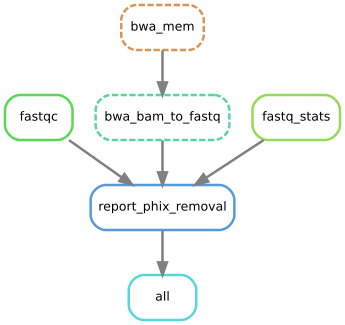

:Overview: cleanup FastQ raw data from a Phix (known contaminant)
:Input: FastQ raw data from Illumina Sequencer (either paired or not)
:Output: FastQ raw with clean reads (no phix) in ./<PROJECT>/bwa_bam_to_fastq/
:config:
    - samples:file1
    - samples:file2
    - project
    - bwa_mem:reference

